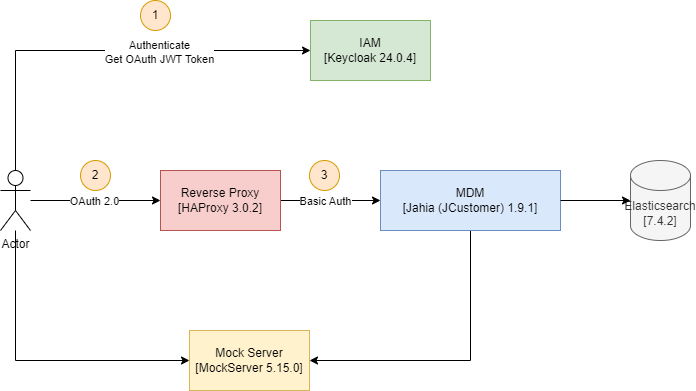
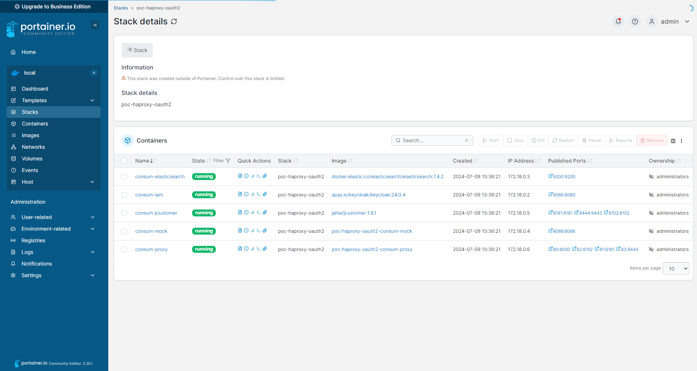
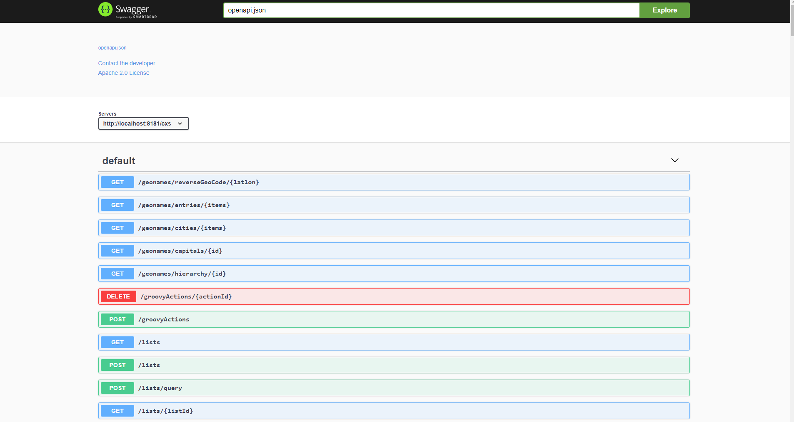

# Description

PoC to autenticate a mock service using OAuth 2

- **HAProxy**: Reverse proxy service version 3.0.2
- **Springboot**: Mock Springboot service version 3.3.1
- **Keycloak**: IAM service version 24.0.4
- **Jahia (jcustomer)**: MDM service version 1.9.1
- **Elasticsearch**: MDM Database service version 7.16.3
- **Elasticsearch Old**: MDM Database service version 7.4.2 (To check the snapshots exported)
- **MockServer**: MockServer service version 5.15.0

## Install from Docker

### Architecture Diagram


### Compile springboot mock service
```
$ ./mvnw clean install
```

### Create a network called consum for our stack
```
$ docker network create consum
```

### Compile services and start compose stack
```
$ docker compose up -d --no-deps --build
```



### Create two users to test
We must create manually two users accounts after keycloak start from Admin Portal UI. Access to Web Portal UI from:

```
http://localhost:8080
```

with credentials: admin/password

1. **Admin Account**
- Credentials: admin/password
- Email: admin@oferto.io
- Firstname: Admin
- Lastname: Actor
- Role: admin

2. **User Account**:
- Credentials: user/password
- Email: user@oferto.io
- Firstname: User
- Lastname: Actor
- Role: user

### Get a valid token

Get a valid token from Admin account:
```
$ curl --location 'http://localhost:8080/realms/mock/protocol/openid-connect/token' \
--header 'Content-Type: application/x-www-form-urlencoded' \
--data-urlencode 'grant_type=password' \
--data-urlencode 'client_id=mock' \
--data-urlencode 'username=admin' \
--data-urlencode 'password=password'
```

### Test Mock service

Test mock service authenticated from HAProxy using the previous issued token:

```
$ curl --location 'http://localhost' --header "Authorization: Bearer <YOUR_ACCESS_TOKEN>"
```

We can access directly to the mock service without any token
```
$ curl --location 'http://localhost:8088'

Hello Mock
```

### Test Jahia service

Test Jahia service authenticated from HAProxy using the previous issued token:

```
$ curl --location 'http://localhost:81/cxs/lists' --header "Authorization: Bearer <YOUR_ACCESS_TOKEN>"

{"list":[],"offset":0,"pageSize":50,"totalSize":0,"totalSizeRelation":"EQUAL","scrollIdentifier":null,"scrollTimeValidity":null}
```

Possible results:

- **Try mock request without any token**: Missing Authorization HTTP header
- **Try mock request with expired token**: JWT has expired
- **Try mock request with expired token not well formed**: Unsupported JWT signing algorithm
- **Try mock request with a valid token**: Hello Mock

### Jahia Open API UI

Open this link to access to Jahia Open API Web UI
```
http://localhost:8181/cxs/api-docs?url=openapi.json
```


### Para acceder al mock-server

```
http://localhost:1080/mockserver/dashboard
```

### Event Cluster Status API Test:

```
GET http://localhost:81/cxs/cluster
```

### Event Collection API Test:

```
POST http://localhost:81/cxs/profiles/search
```

with body:

```
{
    "offset": 0,
    "sortby": null,
    "forceRefresh": true,
    "condition": {
        "type": "codigoSocio",
        "parameterValues": {
            "string": "111111"
        }
    },
    "limit": 5,
    "text": null
}
```

with Authentication header:

```
Authentication: Bear <ACCESS_TOKEN>
```

### Stop and remove stack services from compose

```
$ docker compose down
```

### Snapshot for MDM Elastic

The MDM Elastic service offer an API to manage snapshots. Also Elastic has a environment variable called **path.repo** from where any repository snapshot will we created relative to this value. We will use the default value **/usr/share/elasticsearch/backup** to define this repository inside elastic to save our respository snapshots and the snapshots create inside each one.

### Create a snapshot repository

To create a snapshot repository releative to the **path.repo** folder we will use the API of Elastic for it.

We select the name **my-mdm_backup** for this snapshot repository localed in **mdm_backup** folder inside the folder defined in the environment variable **path.repo**:

```
PUT http://localhost:9201/_snapshot/my-mdm_backup
{
    "type": "fs",
    "settings": {
        "location": "mdm_backup"
    }
}
```

Finally afte execute this command we will se a folder in **/usr/share/elasticsearch/backup/mdm_backup** where we can save snapshots

### Create a snapshot 

Now we a snapshot reppository defined we can create a snapshot inside with this command where define the spapshot repository to use in our case **my-mdm_backup** and the name of the final snapshot for example **my_snapshot_20240719162000**

```
PUT http://localhost:9200/_snapshot/my-mdm_backup/my_snapshot_20240719162000
```

Afte some seconds elastic will create some files that represent all indices and metadata exported inside this folder.

### List snapshots

We can list all snaphots from snapshot repository. Of course we will see the last one created **my_snapshot_20240719162000**

```
GET http://localhost:9202/_snapshot/my-mdm_backup/*?verbose=false
```

### Install JCustomer Events Checker Validator

Execute this command to install the last node package JCustomer validator events checker

```
$ npm i -g @jahia/jcustomer-custom-event-checke
```

```
$ jcustomer-custom-event-checker --help
```

Execute comparation between JCustomer 1.9.1 and JCustomer 7.16.3

```
$ jcustomer-custom-event-checker validateEvents -f C:\git\poc-mdm-haproxy-oauth2\events\checker-config.json -o C:\git\poc-mdm-haproxy-oauth2\events\errors.json
Looking for configuration in file C:\git\poc-mdm-haproxy-oauth2\events\checker-config.json
The following scopes are missing on the target instance: ["12345","SOCIAL-DEV","MCONSUM-TEST","SOCIAL-TEST","MCONSUM-PRE","SOCIAL-PRE","WEBCONSUM-PRE","IAM-PRE","WEBCONSUM-TEST","TOL-PRE","IAM-TEST","CRM-TEST","Prueba","TOL-TEST","MundoConsum","TOL-DEV","PRUEBA-DEV","PRUEBA","CRM-PRE","PRUEBA2-DEV","Prueba1"]
---
You must create these scopes before proceeding any further with event checking
See: https://unomi.apache.org/manual/latest/#_scopes_declarations_are_now_required
You can use the --createScopes flag to create these scopes automatically.
The script will now EXIT, please create these scopes scopes and start again.
Analyzing the events... !
```

Repeat the validation with the new 

```
jcustomer-custom-event-checker validateEvents -f C:\git\poc-mdm-haproxy-oauth2\events\checker-config.json -o C:\git\poc-mdm-haproxy-oauth2\events\errors.json --createScopes
Looking for configuration in file C:\git\poc-mdm-haproxy-oauth2\events\checker-config.json
The following scopes are missing on the target instance: ["12345","SOCIAL-DEV","MCONSUM-TEST","SOCIAL-TEST","MCONSUM-PRE","SOCIAL-PRE","WEBCONSUM-PRE","IAM-PRE","WEBCONSUM-TEST","TOL-PRE","IAM-TEST","CRM-TEST","Prueba","TOL-TEST","MundoConsum","TOL-DEV","PRUEBA-DEV","PRUEBA","CRM-PRE","PRUEBA2-DEV","Prueba1"]
Creating scope: 12345... done
Creating scope: SOCIAL-DEV... done
Creating scope: MCONSUM-TEST... done
Creating scope: SOCIAL-TEST... done
Creating scope: MCONSUM-PRE... done
Creating scope: SOCIAL-PRE... done
Creating scope: WEBCONSUM-PRE... done
Creating scope: IAM-PRE... done
Creating scope: WEBCONSUM-TEST... done
Creating scope: TOL-PRE... done
Creating scope: IAM-TEST... done
Creating scope: CRM-TEST... done
Creating scope: Prueba... done
Creating scope: TOL-TEST... done
Creating scope: MundoConsum... done
Creating scope: TOL-DEV... done
Creating scope: PRUEBA-DEV... done
Creating scope: PRUEBA... done
Creating scope: CRM-PRE... done
Creating scope: PRUEBA2-DEV... done
Creating scope: Prueba1... done
Analyzing the events (events processed: 6000)... done
Processed 6000 events in 165318 ms
```

### Access ssh to JCustomer

Connect to the instance of the JCustomer and execute inside this command:

```
$ apt-get update
$ apt-get install openssh-client
```

```
$ ssh -p 8102 karaf@127.0.0.1
```

with the default password karaf

Set debug mode for more details in the logs, inside the ssh connection execute this command:

```
log:set DEBUG
```

### json-schemas management

We have some endpoints in Unomi to manage and register the json-schemas:

To list json-schema registered
```
$ curl -X GET "http://localhost:8181/cxs/jsonSchema" -H "accept: application/json"
```

To register a new json-schema

```
$ curl -X POST "http://localhost:8181/cxs/jsonSchema" -H "accept: application/json" -H "Content-Type: application/json" -d "
{
    "$id": "https://consum.es/schemas/json/events/recuperarUsuario/1-0-0",
    "$schema": "https://json-schema.org/draft/2019-09/schema",
    "self": {
        "vendor": "es.consum",
        "target": "events",
        "name": "recuperarUsuario",
        "format": "jsonschema",
        "version": "1-0-0"
    },      
    "title": "RecuperarUsuarioEvent",     
    "type": "object",
    "properties": {
      "idMdm": {
        "type": "string"
      },
      "fechaModificacion": {
        "type": "string"
      },
      "aplicacionModificacion": {
        "type": "string"
      },
      "idTransaccion": {
        "type": "string"
      }
    }
  }"
```

To delete a json-schema

```
$ curl -X POST "http://localhost:8181/cxs/jsonSchema/delete" -H "accept: application/json;charset=UTF-8" -H "Content-Type: */*" -d "https://cosum.es/schemas/json/events/poblarUsuario/1-0-0"
```

To validate a document

```
$ curl -X POST "http://localhost:8181/cxs/jsonSchema/validateEvent" -H "accept: application/json;charset=UTF-8" -H "Content-Type: text/plain" -d "{\"eventType\":\"altaUsuario\",\"scope\":\"Prueba\",\"properties\":{\"userInfo\":{\"personasEnHogar\":\"2\",\"codigoSocio\":\"123213123\",\"ordenUnidadFamiliar\":\"1\",\"tiendaCaptacion\":\"42\",\"unidadFamiliar\":\"1406280\",\"tarjetaPago\":\"N\",\"idioma\":\"E\",\"idMdm\":\"1a5ba9593ba4948b2c48062a6e331ae0a\",\"tiendaAsignacion\":\"42\",\"socioCanal\":[{\"restringido\":\"NO\",\"codigoCanal\":\"1\"},{\"restringido\":\"NO\",\"codigoCanal\":\"2\"},{\"restringido\":\"NO\",\"codigoCanal\":\"3\"},{\"restringido\":\"NO\",\"codigoCanal\":\"4\"},{\"restringido\":\"NO\",\"codigoCanal\":\"5\"}],\"infoPersonal\":{\"apellido2\":\"3213123\",\"fechaNacimiento\":\"26/11/1946\",\"apellido1\":\"PRUEBA\",\"direccion\":{\"puerta\":\"A\",\"patio\":\"8\",\"domicilio\":\"COMETA II\",\"codigoPostal\":\"3710\",\"tipoVia\":\"PTDA\",\"codigoCalle\":\"304754000\",\"poblacion\":\"CALPE/CALP\",\"provincia\":\"ALICANTE/ALACANT\"},\"documentoPrincipal\":{\"tipoDocumento\":\"NIF\",\"numDocumento\":\"ZZZ978\"},\"telefonoMovil\":\"679592986\",\"sexo\":\"H\",\"nombre\":\"SOPRA2\",\"telefonoFijo\":\"965837195\"},\"recibirRevista\":\"N\",\"numTarjetaFidelizacion\":\"2901406280011\"},\"fechaModificacion\":\"1610443398277\",\"idTransacion\":\"a5bf803c-98a1-41ac-a086-0ef5870b83c0da\",\"aplicacionModificacion\":\"PRUEBAXXX\"}}"
```

## Install from binaries

### Download Elastic binary

Download the tar ball and install of Elastic 7.16.3 in /opt/elasticsearch folder:

```
$ cd /opt
$ sudo wget https://artifacts.elastic.co/downloads/elasticsearch/elasticsearch-7.16.3-linux-x86_64.tar.gz
$ sudo tar -xf elasticsearch-7.16.3-linux-x86_64.tar.gz
$ sudo rm elasticsearch-7.16.3-linux-x86_64.tar.gz
$ sudo chown <ELASTICSEARCH_USER>:<ELASTICSEARCH_USER> elasticsearch-7.16.3 -R
$ sudo ln -s elasticsearch-7.16.3/ elasticsearch
```

Edit the file **elasticsearch.yml** located in **/opt/elasticsearch/config/elasticsearch.yml** and set these environment variables:

```
cluster.name: contextElasticSearch
path.repo: /opt/elasticsearch/snapshots
discovery.type: single-node
```

Create a folder called **snapshots** inside elasticsearch folder. This name is the same used in the previous environment variable called **path.repo**

Start elastic as daemon:

```
//./elasticsearch/bin/elasticsearch -d -Ediscovery.type=single-node -Ecluster.name=contextElasticSearch -Epath.repo=/usr/share/elasticsearch/snapshots
./elasticsearch/bin/elasticsearch
```

Create a new snapshot repository folder inside **snapshots** called **mdm_backup**. Then copy the original snapshot resouces inside the previous snapshort repository called **mdm_backup**. **We must set the correct owner of all resources after been copied**:

Now we create the repository snapshot called **mdm_backup** located in the folder **mdm_backup** like this:

```
PUT http://localhost:9200/_snapshot/mdm_backup
{
    "type": "fs",
    "settings": {
        "location": "mdm_backup"
    }
}

```

Now we can list the repository snapshot and snapshots inside it like this:

List snapshot repositories

```
GET http://localhost:9200/_snapshot
```

List snapshots inside the snapshot repository called 

```
GET http://localhost:9200/_snapshot/mdm_backup/*?verbose=false
```

Now we can restore the snapshot in our elastic instance. If we have problems with the index called **.geoip_databases** because already exist and is not possible restore, we can disable the plugin geoip to remove this index, restore the snapshot and later restore the pluging again:

Disable the plugin geoip, we must pass the elastic password (changeme):

```
$ curl -k -XPUT -u elastic "https://localhost:9200/_cluster/settings" \
 -H 'Content-Type: application/json' \
-d'
{
	"persistent": {
	"ingest.geoip.downloader.enabled":"false"
	}
}'
```

Restore the snapshot:

```
http://localhost:9200/_snapshot/mdm_backup/my_snapshot_20240816154100/_restore
```

Restore the plugin geoip, we must pass the elastic password (changeme):

```
$ curl -k -XPUT -u elastic "https://localhost:9200/_cluster/settings" \
 -H 'Content-Type: application/json' \
-d'
{
	"persistent": {
	"ingest.geoip.downloader.enabled":null
	}
}'
```

Finally we can list the indices restored, and wate to the green status in all of them before integrate with the mdm.

```
http://localhost:9200/_cat/indices?v=true&s=index
```

### Download JCustomer binary

Download the tarball and install of JCustomer 2.5.0 in /opt/jcustomer folder:

```
$ cd /opt
$ sudo wget https://downloads.jahia.com/downloads/jahia/jcustomer/jcustomer-2.5.0.tar.gz
$ sudo tar -xf jcustomer-2.5.0.tar.gz
$ sudo rm jcustomer-2.5.0.tar.gz
$ sudo chown <JCUSTOMER_USER>:<JCUSTOMER_USER> jcustomer-2.5.0 -R
$ sudo ln -s jcustomer-2.5.0/ jcustomer
```

Copy to last  JCustomer (2.0.5) extensions to deploy JCustomer folder:

```
$ cp /mnt/c/git/poc-mdm-haproxy-oauth2/jcustomer/altaUsuarioBroker-2.0.5.jar ./jcustomer/deploy/altaUsuarioBroker-2.0.5.jar
$ cp /mnt/c/git/poc-mdm-haproxy-oauth2/jcustomer/bajaUsuarioBroker-2.0.5.jar ./jcustomer/deploy/bajaUsuarioBroker-2.0.5.jar
$ cp /mnt/c/git/poc-mdm-haproxy-oauth2/jcustomer/modificarUsuarioBroker-2.0.5.jar ./jcustomer/deploy/modificarUsuarioBroker-2.0.5.jar
$ cp /mnt/c/git/poc-mdm-haproxy-oauth2/jcustomer/poblarUsuarioBroker-2.0.5.jar ./jcustomer/deploy/poblarUsuarioBroker-2.0.5.jar
$ cp /mnt/c/git/poc-mdm-haproxy-oauth2/jcustomer/recuperarUsuarioBroker-2.0.5.jar ./jcustomer/deploy/recuperarUsuarioBroker-2.0.5.jar
```

```
./jcustomer/bin/start -d -EUNOMI_ELASTICSEARCH_ADDRESSES=<ELASTICSEACH_HOST>:<ELASTICSEACH_PORT>
```

## Links

- [Download Elastic 7.1.6.3](https://www.elastic.co/es/downloads/past-releases/elasticsearch-7-16-3)
- [Download JCustomer 2.5.0](https://academy.jahia.com/customer-center/jexperience#jcustomer-downloads)
- [jCustomer event checker in JCustomer 2.x](https://academy.jahia.com/documentation/jexperience/jexperience-2.x-and-3.x/system-administrator/upgrading-jcustomer/jcustomer-event-checker)
